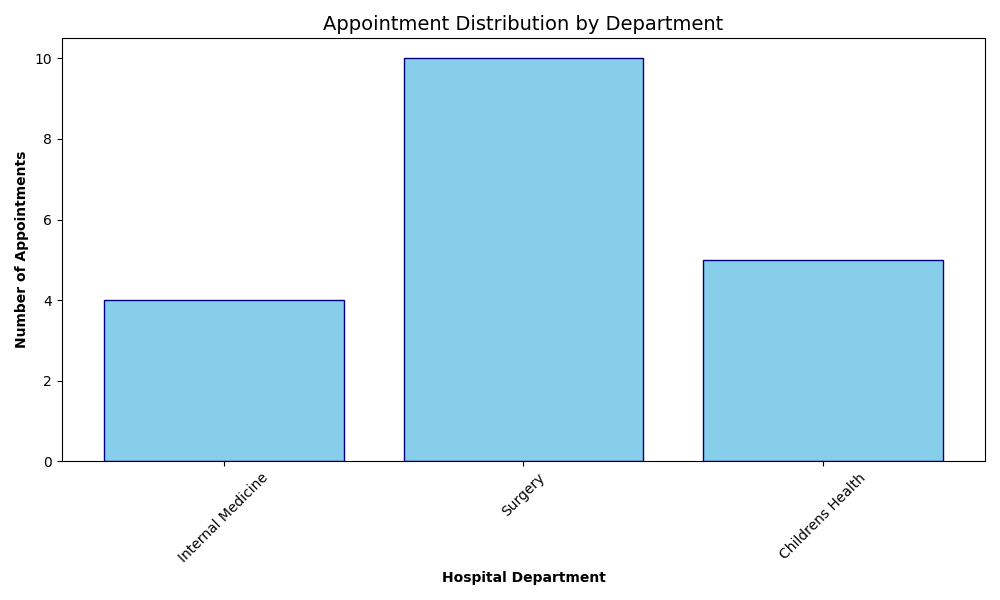

# *HOSPITAL MANAGMENT SYSTEM.*

## **Project Overview**
This project is a robust backend database solution for a Hospital Management System. It features a relational MySQL database populated with a mix of manual entries and synthetic data generated via Python. The system manages Patients, Doctors, and Appointments, ensuring data integrity through relational mapping.

### *Note:*
All data used in this project is auto-generated using the "faker" library for practice and academic purposes only.

## **Tech Stack**
Database: MySQL
Language: Python 3.x
Libraries: mysql-connector-python, faker, csv
Tools: MySQL Workbench, VS Code

## **Database Schema**
*The database (hms_db) consists of three primary tables:*

1. **Patients:** Stores demographic data with custom identifiers (e.g., HMS/001).

2. **Doctors:** Categorized by specialization and department.

3. **Appointments:** A junction table linking patients to doctors with specific dates and statuses.

## **Key Features & Challenges Solved**
1. **Custom Data Generation:** Developed a Python script using the Faker library to generate 50+ realistic patient records while maintaining specific Ugandan-style phone number formats (e.g., 077...).

2. **Data Cleaning (ETL):** Handled strict MySQL date format requirements (YYYY-MM-DD) by creating a transformation logic during the CSV upload process.

3. **Referential Integrity:** Implemented Foreign Keys to ensure that appointments cannot be created for non-existent patients or doctors.

4. **Relational Queries:** Designed complex SQL joins to generate real-time hospital schedules and department performance reports.

## **Development Process**

1. **Requirement Analysis:** Identified the need for a system to track patient-doctor interactions.
2. **Schema Creation:** Drafted SQL scripts to build a relational structure in MySQL.
3. **Synthetic Data Pipeline:** Wrote a Python script to populate the database, ensuring realistic local data formatting.
4. **Data Validation:** Resolved critical errors regarding date formatting and string length constraints during the upload phase.
5. **Testing:** Verified data integrity using complex SQL JOINs to generate hospital reports.

## **Data Insights**
Below is a visualization of the appointment distribution across various hospital departments, generated directly from the MySQL database using Python.

